<div align="center">

# frame-svg

***SVG layout engine for code-first documentation — primitives, themes, and compound components, zero dependencies.***

</div>



frame-svg renders structured SVGs directly from TypeScript. It uses a JSX-like `.frame` syntax, a flexbox-inspired layout engine, and a theme variable system.

**The output is a single `.svg` file that adapts to the user's theme automatically** — dark mode users see dark colors, light mode users see light colors, with no JavaScript and no duplicated files. Embed it anywhere: GitHub READMEs, documentation sites, or any webpage, and it just works.

## How it works

Write a `.frame` file with layout primitives and compound components. Run the renderer. Get an SVG.

The layout engine resolves sizes in a single deterministic pass — no DOM, no browser. Theme variables (`$accent`, `$surface`, `$text`, …) become CSS classes in the SVG output, so GitHub renders the correct colors for each user's system preference.

## Core concepts

| Term | Meaning |
|------|---------|
| `.frame` file | A TypeScript/JSX file with `.frame` extension — auto-imports all primitives and compound components |
| Primitive | A layout node: `Stack`, `Box`, `Text`, `Circle`, `Line`, `Grid`, `Spacer`, `Icon` |
| Compound component | A higher-level component built from primitives: `Card`, `Avatar`, `Callout`, `FeatureList`, `FileTree`, `KeyCombo`, `Stat` |
| Theme variable | A `$name` string in any color prop that resolves to a CSS class with dark/light values |
| Page | The root node — sets canvas width, padding, background, and embeds the theme |

## Quick install

```bash
npm install frame-svg
```

## Quick start

1. Create `src/main.frame`:

```tsx
<Page theme={theme} width={720} padding={36} background="$bg">
  <Stack gap={16}>
    <Text fontSize={24} fontWeight="700" color="$text">Hello, frame-svg</Text>
    <Callout variant="tip" message="This renders as an SVG." />
  </Stack>
</Page>
```

2. Run the renderer:

```bash
npm run render
```

3. The rendered SVG is generated in `dist/`.

4. Embed it wherever you need it.

## Documentation

| | |
|---|---|
| [Getting Started](docs/01-getting-started.md) | Installation, first render, project structure |
| [Philosophy](docs/02-philosophy.md) | The .frame model, Vue-style conventions |
| [Theme](docs/03-theme.md) | Variables, dark/light mode, customization |
| [Primitives](docs/04-primitives.md) | Page, Stack, Box, Text, Circle, Line, Grid, Spacer |
| [Icons](docs/05-icons.md) | Built-in icon set and usage |
| [Compound Components](docs/06-compound.md) | Card, Avatar, Callout, FeatureList, FileTree, KeyCombo, Stat |
| [VSCode Extension](docs/07-vscode-extension.md) | Syntax highlighting and autocomplete |
| [Scripts](docs/08-scripts.md) | dev, render, render:img, schema, ext:install |
| [Internals](docs/09-internals.md) | Pipeline, layout engine, renderer |
| [Examples](docs/examples.md) | Visual reference with SVG previews |
| [AI Skill](docs/10-ai-skill.md) | Claude Code skill for designing with frame-svg |

## VS Code

Install [Material Icon Theme](https://marketplace.visualstudio.com/items?itemName=PKief.material-icon-theme) to get an SVG icon for `.frame` files. The setting is already included in `.vscode/settings.json`.

## Contributing

See [CONTRIBUTING.md](CONTRIBUTING.md) for the full process — issue first, code second.

## Credits

Contributions are recognized here. If your pull request is merged, your name or handle and what you contributed will be listed below.

| Contributor | Contribution |
|-------------|-------------|
| — | — |

## License

[MIT](LICENSE)
