# Examples

## Typography

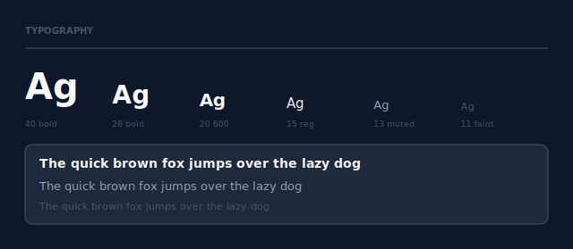

```tsx
<Text fontSize={40} fontWeight="700" color="$text">Heading</Text>
<Text fontSize={15} color="$text">Body text</Text>
<Text fontSize={13} color="$muted">Secondary</Text>
<Text fontSize={11} color="$faint">Caption</Text>
```

| Prop | Type | Description |
|------|------|-------------|
| `fontSize` | `number` | Font size in px |
| `fontWeight` | `string` | `'400'`, `'500'`, `'600'`, `'700'` |
| `color` | `string` | Color or theme token |
| `textAlign` | `'left' \| 'center' \| 'right'` | Text alignment |
| `lineHeight` | `number` | Line height multiplier |

---

## Color palette

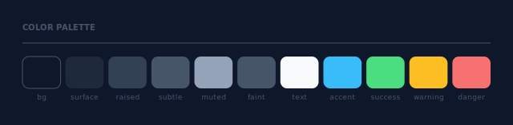

Theme tokens resolve to dark/light values automatically via `prefers-color-scheme`. Use them in any `color`, `background`, or `border` prop.

| Token | Usage |
|-------|-------|
| `$bg` | Page background |
| `$surface` | Card / panel background |
| `$raised` | Elevated elements |
| `$subtle` | Borders, dividers |
| `$muted` | Secondary text |
| `$faint` | Labels, captions |
| `$text` | Primary text |
| `$accent` | Brand / interactive |
| `$success` · `$warning` · `$danger` | Semantic colors |

---

## Gradients & shadows

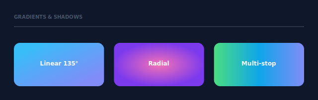

```tsx
<Box background={{ type: 'linear', angle: 135, stops: [
  { offset: 0, color: '#38bdf8' },
  { offset: 1, color: '#818cf8' },
]}} shadow={{ y: 8, blur: 20, color: 'rgba(56,189,248,0.25)' }} />

<Box background={{ type: 'radial', stops: [
  { offset: 0, color: '#f472b6' },
  { offset: 1, color: '#7c3aed' },
]}} />
```

---

## Shapes

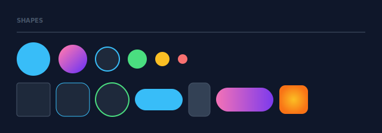

```tsx
<Circle size={48} background="$accent" shadow={{ blur: 12, color: 'rgba(56,189,248,0.3)', y: 4 }} />
<Circle size={40} background="$surface" border={{ width: 2, color: '$accent' }} />

<Box width={56} height={56} radius={14} background="$surface" border={{ width: 1, color: '$accent' }} />
<Box width={96} height={40} radius={20} background={{ type: 'linear', angle: 90, stops: [
  { offset: 0, color: '#f472b6' },
  { offset: 1, color: '#7c3aed' },
]}} />
```

---

## Badges

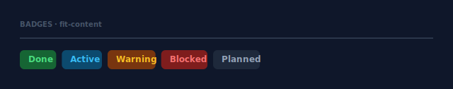

Badges are plain `Box` + `Text` combinations using `width="fit-content"`:

```tsx
<Box width="fit-content" background="$successBg" radius={6} padding="5 12">
  <Text fontSize={12} fontWeight="700" color="$success">Done</Text>
</Box>
<Box width="fit-content" background="$accentBg" radius={6} padding="5 12">
  <Text fontSize={12} fontWeight="700" color="$accent">Active</Text>
</Box>
```

---

## Grid

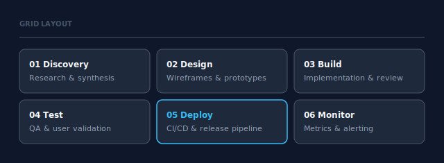

```tsx
<Grid columns={3} gap={10}>
  <Box background="$surface" radius={8} padding={14}>
    <Text fontSize={12} fontWeight="600" color="$text">01  Discovery</Text>
    <Text fontSize={11} color="$muted" margin="3 0 0 0">Research & synthesis</Text>
  </Box>
  {/* ... */}
</Grid>
```

| Prop | Type | Description |
|------|------|-------------|
| `columns` | `number` | Number of equal-width columns |
| `gap` | `number` | Gap between cells |

---

## Line

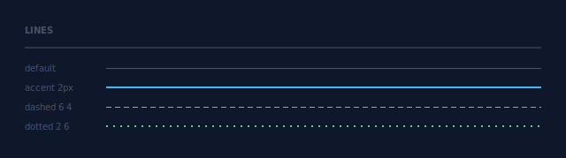

```tsx
<Line color="$subtle" />
<Line color="$accent" thickness={2} />
<Line color="$muted"  dash="6 4" />
<Line color="$success" thickness={2} dash="2 6" />
```

| Prop | Type | Default | Description |
|------|------|---------|-------------|
| `color` | `string` | — | Stroke color or token |
| `thickness` | `number` | `1` | Line thickness in px |
| `dash` | `string` | — | SVG `stroke-dasharray` value |
| `width` | `number \| string` | `'100%'` | Line width |

---

## Callout

Highlights important information inline — note, tip, warning, or important.

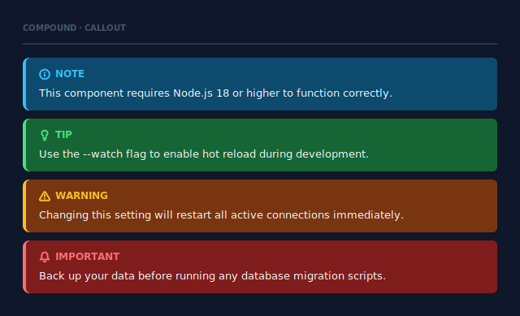

```tsx
<Callout variant="note"      message="This component requires Node.js 18 or higher." />
<Callout variant="tip"       message="Use the --watch flag to enable hot reload." />
<Callout variant="warning"   message="Changing this setting restarts all connections." />
<Callout variant="important" message="Back up your data before running migrations." />
```

| Prop | Type | Default | Description |
|------|------|---------|-------------|
| `variant` | `'note' \| 'tip' \| 'warning' \| 'important'` | `'note'` | Visual style and icon |
| `message` | `string` | — | Body text |
| `width` | `number \| string` | `'100%'` | Container width |
| `margin` | `SpacingValue` | — | Outer spacing |

---

## FeatureList

Renders a list of items with optional checked/unchecked state and descriptions.

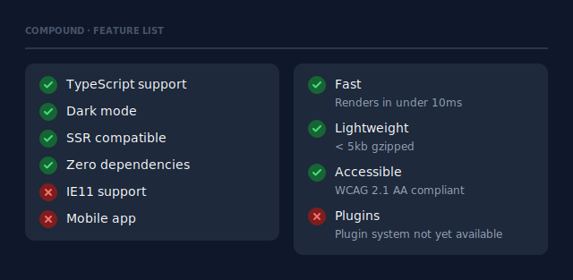

```tsx
<FeatureList items={[
  { label: 'Zero dependencies', checked: true  },
  { label: 'Dark & light mode', checked: true  },
  { label: 'IE11 support',      checked: false },
  { label: 'Plugin system',     checked: false, description: 'Not yet available' },
]} />
```

| Prop | Type | Default | Description |
|------|------|---------|-------------|
| `items` | `FeatureItem[]` | — | List of items |
| `width` | `number \| string` | `'100%'` | Container width |
| `padding` | `SpacingValue` | `'14 16'` | Inner padding |
| `gap` | `number` | `10` | Gap between rows |

`FeatureItem`: `label: string` · `checked?: boolean` (`true` = check, `false` = cross, omit = dot) · `description?: string`

---

## FileTree

Renders a directory structure with optional highlights and inline comments.

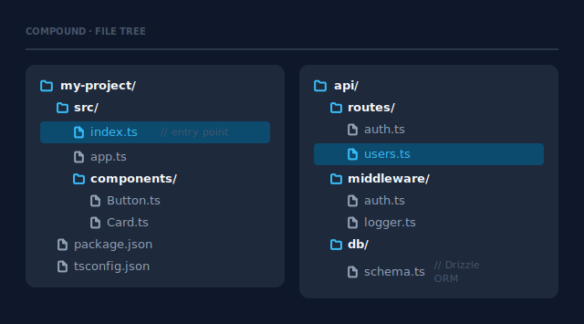

```tsx
<FileTree
  root="my-project"
  items={[
    { name: 'src',          type: 'dir',  depth: 0 },
    { name: 'index.ts',     type: 'file', depth: 1, highlight: true, comment: '// entry point' },
    { name: 'app.ts',       type: 'file', depth: 1 },
    { name: 'package.json', type: 'file', depth: 0 },
  ]}
/>
```

| Prop | Type | Default | Description |
|------|------|---------|-------------|
| `items` | `FileTreeItem[]` | — | List of files and directories |
| `root` | `string` | — | Optional root folder name |
| `width` | `number \| string` | `'100%'` | Container width |

`FileTreeItem`: `name` · `type: 'file' \| 'dir'` · `depth: number` · `highlight?: boolean` · `comment?: string`

---

## KeyCombo

Renders a keyboard shortcut as styled key caps.

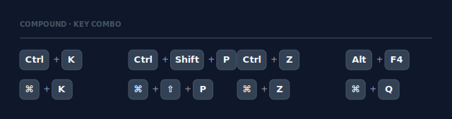

```tsx
<KeyCombo keys={['Ctrl', 'K']} />
<KeyCombo keys={['Ctrl', 'Shift', 'P']} />
<KeyCombo keys={['⌘', '⇧', 'P']} />
```

| Prop | Type | Default | Description |
|------|------|---------|-------------|
| `keys` | `string[]` | — | Key labels in order |
| `gap` | `number` | `6` | Gap between keys |

---

## Stat

Displays a metric with a label and optional trend indicator.

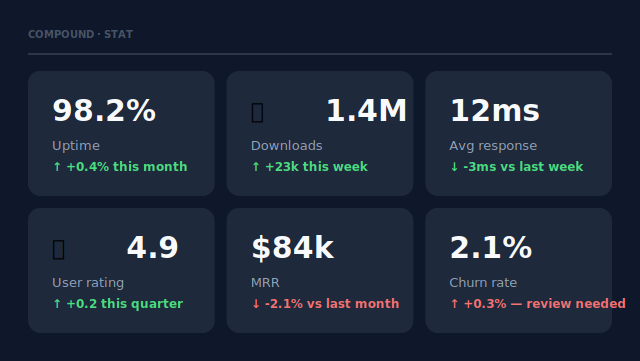

```tsx
<Stat value="98.2%" label="Uptime"    trend="↑ +0.4% this month"    trendUp={true}  />
<Stat value="1.4M"  label="Downloads" trend="↑ +23k this week"       trendUp={true} icon="📦" />
<Stat value="$84k"  label="MRR"       trend="↓ -2.1% vs last month"  trendUp={false} />
```

Wrap in `<Grid columns={3} gap={12}>` for a dashboard layout.

| Prop | Type | Default | Description |
|------|------|---------|-------------|
| `value` | `string` | — | Main metric value |
| `label` | `string` | — | Metric label |
| `trend` | `string` | — | Trend description line |
| `trendUp` | `boolean` | — | `true` = green, `false` = red |
| `icon` | `string` | — | Optional emoji shown next to value |

---

## Avatar

Displays a user avatar with initials or emoji, with optional status indicator.

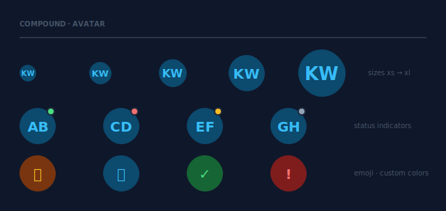

```tsx
<Avatar label="KW" size="md" />
<Avatar label="KW" size="lg" status="online" />
<Avatar label="🦊" size="lg" background="$warningBg" color="$warning" />
```

| Prop | Type | Default | Description |
|------|------|---------|-------------|
| `label` | `string` | — | Initials or emoji |
| `size` | `'xs' \| 'sm' \| 'md' \| 'lg' \| 'xl'` | `'md'` | Avatar size |
| `status` | `'online' \| 'busy' \| 'away' \| 'offline'` | — | Status indicator dot |
| `background` | `string` | `'$accent'` | Background color or token |
| `color` | `string` | `'$surface'` | Text color or token |

---

## Card

A content card with title, body, optional badge, avatar initial, and divider.

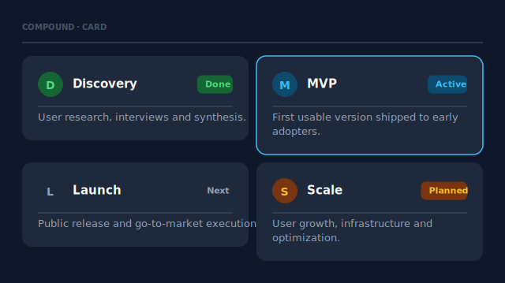

```tsx
<Card
  title="MVP"
  body="First usable version shipped to early adopters."
  badge="Active"
  badgeVariant="accent"
  avatar="M"
  divider={true}
  border={{ width: 1.5, color: '$accent' }}
  shadow={{ blur: 8, color: '#00000040', y: 2 }}
/>
```

| Prop | Type | Default | Description |
|------|------|---------|-------------|
| `title` | `string` | — | Card heading |
| `body` | `string` | — | Body text |
| `badge` | `string` | — | Badge label |
| `badgeVariant` | `'accent' \| 'success' \| 'warning' \| 'danger' \| 'neutral'` | `'neutral'` | Badge color |
| `avatar` | `string` | — | Single character avatar |
| `divider` | `boolean` | `false` | Line between header and body |
| `border` | `BorderProps` | — | Card border |
| `shadow` | `Shadow` | — | Drop shadow |

---

## Icon

Stroke-based SVG icons — 24×24 viewBox, scales to any size.

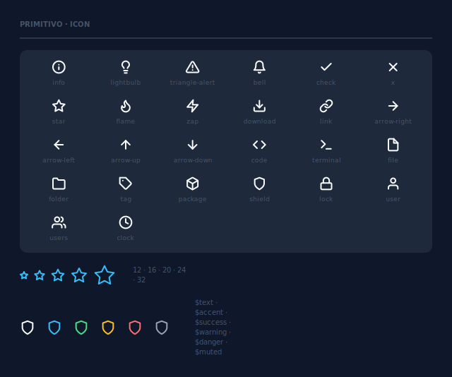

```tsx
<Icon name="star"   size={20} color="$accent" />
<Icon name="shield" size={24} color="$success" />
<Icon name="zap"    size={16} color="$warning" strokeWidth={1.5} />
```

| Prop | Type | Default | Description |
|------|------|---------|-------------|
| `name` | `IconName` | — | Icon identifier |
| `size` | `number` | `20` | Width and height in px |
| `color` | `string` | `'$text'` | Stroke color or theme token |
| `strokeWidth` | `number` | `2` | Stroke weight |
| `margin` | `SpacingValue` | — | Outer spacing |

Available: `info` · `lightbulb` · `triangle-alert` · `bell` · `check` · `x` · `star` · `flame` · `zap` · `download` · `link` · `arrow-right` · `arrow-left` · `arrow-up` · `arrow-down` · `code` · `terminal` · `file` · `folder` · `tag` · `package` · `shield` · `lock` · `user` · `users` · `clock`
